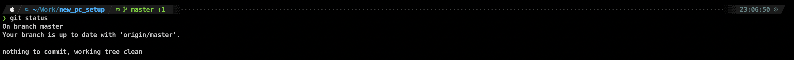

# New PC Setup
From time to time I find my self in need to re-setup my OS. Wasting time in installing some apps is so inconvenient. I am trying to put here all the easy boilerplate setups.

## Prerequisite

1. curl
    1. Mac no action
    2. Ubuntu `sudo apt-get install curl`
2. zsh
    1. Mac no action
    2. Ubuntu `sudo apt-get install zsh`
3. git
    1. Mac no action
    2. Ubuntu `sudo apt-get install git`

## Installing Oh My Zsh

```bash
sh -c "$(curl -fsSL https://raw.github.com/robbyrussell/oh-my-zsh/master/tools/install.sh)"
```
Ref. [Oh My Zsh](https://github.com/robbyrussell/oh-my-zsh)

## Installing Powerlevel10k

```bash
git clone https://github.com/romkatv/powerlevel10k.git ${HOME}/.oh-my-zsh/custom/themes/powerlevel10k
sed -i -e 's/ZSH_THEME.*/ZSH_THEME=powerlevel10k\/powerlevel10k/g' ~/.zshrc
```



Ref. [powerlevel10k](https://github.com/romkatv/powerlevel10k)

## Installing NVM

```bash
curl -o- https://raw.githubusercontent.com/nvm-sh/nvm/v0.35.0/install.sh | bash
```

Ref. [NVM](https://github.com/nvm-sh/nvm)